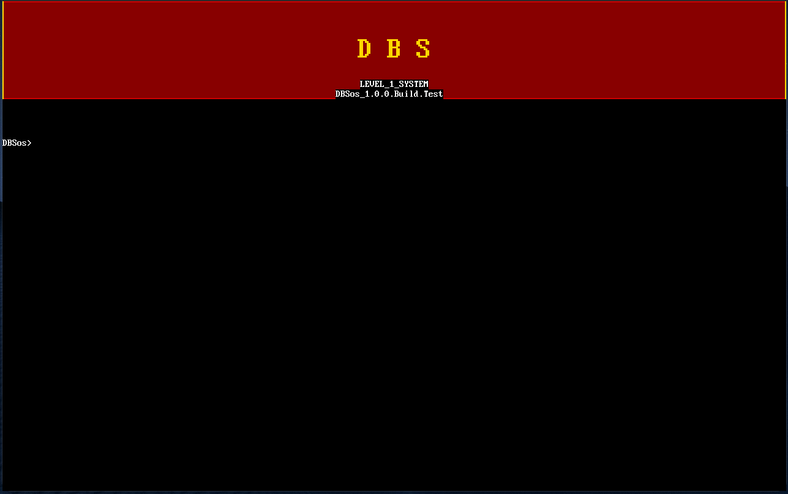
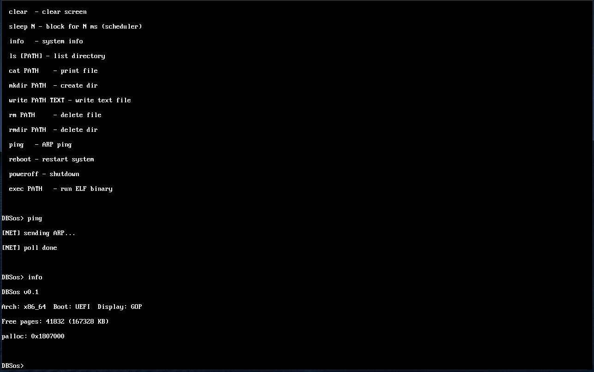

<p align="center">
  
  
  
  
  
  
  
  
</p>

<p align="center">
  <a href="README_EN.md">English</a> | <b>Русский</b>
</p>

<h1 align="center">DBSos</h1>

<p align="center">
  <b>Собственная операционная система с микроядерной архитектурой</b><br>
  Написана на <a href="https://www.rust-lang.org/">Rust</a> для архитектуры <b>x86_64</b><br>
  Загружается напрямую через <b>UEFI</b> (без отдельного загрузчика)
</p>

> **Цель проекта** — создать полноценную ОС на Rust с поддержкой Linux бинарников, графическим рабочим столом и совместимостью с Linux API.

---

## Скриншоты

<p align="center">
  
  <br><i>Экран загрузки с логотипом "DBS" и промптом оболочки</i>
</p>

<p align="center">
  
  <br><i>Графический рабочий стол GNOME Shell (F1 — рабочий стол, F2 — текстовая консоль)</i>
</p>

---

## Быстрый старт

```bash
# 1. Установите Rust + target
rustup target add x86_64-unknown-uefi

# 2. Клонируйте репозиторий
git clone https://github.com/i000993i/DBSos.git
cd DBSos

# 3. Собрать и запустить (Linux/macOS)
./run.sh

# Или вручную:
cargo build -p dbsos-kernel --target x86_64-unknown-uefi
python3 scripts/mk_esp.py        # Создаёт ESP образ (GPT+FAT16)
# Затем запустите QEMU (см. ниже)
```

### Запуск в QEMU

```bash
qemu-system-x86_64 \
  -machine q35 \
  -drive if=pflash,format=raw,readonly=on,file=/usr/share/OVMF/OVMF_CODE_4M.fd \
  -drive file=esp.img,format=raw,id=espblk,if=none \
  -device ide-hd,drive=espblk \
  -drive file=nvme_disk.img,if=none,id=nvme0,format=raw \
  -device nvme,serial=deadbeef,drive=nvme0 \
  -display gtk \
  -m 256M -smp 2 \
  -serial stdio -monitor none \
  -nic user,model=e1000
```

> Путь к OVMF: `find / -name "OVMF_CODE*.fd" 2>/dev/null`
> Установите `OVMF=/путь/к/OVMF_CODE.fd ./run.sh` если OVMF не в стандартном месте.

### Windows (PowerShell)

```powershell
.\scripts\bootstrap.ps1 -Run    # сборка + запуск
.\scripts\bootstrap.ps1          # только сборка
```

### Управление

- **F1** — графический рабочий стол (GNOME Shell)
- **F2** — текстовая консоль (System Console)
- В текстовой консоли: `gui` — вернуться на рабочий стол

---

## Архитектура

```
┌──────────────────────────────────────────────────────────┐
│  Ring 3 (User)                                           │
│  ┌────────────┐ ┌────────────┐ ┌────────────┐           │
│  │ Linux ELF  │ │ Wayland    │ │ GUI Apps   │           │
│  │ Binaries   │ │ Compositor │ │ (Terminal, │           │
│  │            │ │            │ │  Editor,   │           │
│  │            │ │            │ │  Files)    │           │
│  └─────┬──────┘ └─────┬──────┘ └─────┬──────┘           │
│        └──────────────┼──────────────┘                   │
│                       │ IPC (capabilities)               │
├───────────────────────┼──────────────────────────────────┤
│  Ring 0 (Kernel)      ▼                                  │
│  ┌───────────────────────────────────────────────────┐   │
│  │ Core: Memory │ VM │ Scheduler │ Syscall │ VFS     │   │
│  │ Drivers: UART │ PCI │ NVMe │ e1000 │ PS/2 │ HPET │   │
│  │ Display: GOP Framebuffer │ GNOME Shell Desktop     │   │
│  │ Linux Compat: ELF Loader │ Syscall Translation     │   │
│  └───────────────────────────────────────────────────┘   │
│  Boot: UEFI → ExitBootServices → Shell / GUI             │
└──────────────────────────────────────────────────────────┘
```

**Ключевые принципы:**
- **Микроядро** — минимальное ядро, серверы в Ring 3
- **Capability-based** — доступ к ресурсам через capabilities
- **no_std** — ядро без стандартной библиотеки Rust (~20,600 строк)
- **Preemptive** — вытесняющая многозадачность (LAPIC timer ~100 Hz)
- **Demand Paging** — куча/стек процессов мапятся по требованию через VMA
- **Linux Compatibility** — загрузчик Linux ELF бинарников, трансляция syscall'ов

---

## Драйверы и подсистемы

### Драйверы устройств

| Драйвер | Описание | Статус |
|---------|----------|--------|
| **UART 16550** | Последовательный порт COM1, IRQ4 | ✅ |
| **PCI** | Сканер шины, конфигурационное пространство | ✅ |
| **NVMe** | SSD/NVMe диски, admin/IO очереди | ✅ |
| **AHCI/SATA** | SATA диски (AT API) | ⚠️ Зависает на port_init |
| **e1000** | Gigabit Ethernet, DMA TX/RX, ARP/ICMP | ✅ |
| **PS/2 Keyboard** | Scancode set 1 → ASCII, IRQ1 | ✅ |
| **PS/2 Mouse** | 3-байтые пакеты, IRQ12 | ✅ |
| **HPET Timer** | Высокоточный таймер 10 MHz | ✅ |
| **LAPIC Timer** | Локальный APIC таймер ~100 Hz | ✅ |

### Сетевой стек

| Компонент | Описание | Статус |
|-----------|----------|--------|
| **Ethernet** | e1000 DMA кольца, MAC/PHY | ✅ |
| **ARP** | ARP таблица, resolve IP→MAC | ✅ |
| **IPv4** | IP фрейминг, routing | ✅ |
| **ICMP** | Ping (echo request/reply) | ✅ |
| **UDP** | User Datagram Protocol | ✅ |
| **DHCP** | DISCOVER→OFFER→REQUEST→ACK | ✅ |
| **DNS** | A record queries (UDP:53) | ✅ |
| **TCP** | 3-way handshake, retransmission, FIN | ✅ |

### Файловая система

| Компонент | Описание | Статус |
|-----------|----------|--------|
| **VFS** | Виртуальная ФС, mount/fd таблицы | ✅ |
| **FAT12/16/32** | BPB парсинг, кластерные цепочки | ✅ |
| **VFAT LFN** | Long File Name поддержка | ✅ |
| **fs_server** | Файловый сервер в Ring 3 (IPC) | ✅ |

### Графический интерфейс

| Компонент | Описание | Статус |
|-----------|----------|--------|
| **UEFI GOP** | Framebuffer 1280×800 BGRx | ✅ |
| **GNOME Shell** | Top panel, Dash dock, Activities overview | ✅ |
| **Window Manager** | Drag/resize, z-order, decorations | ✅ |
| **Cursor** | Save/restore overlay, 12×18 пикселей | ✅ |
| **Wayland** | Протокол, surfaces, compositor loop | ⚠️ Заготовка |
| **egui** | Immediate-mode GUI (custom, no_std) | ✅ |

### Ядро

| Компонент | Описание | Статус |
|-----------|----------|--------|
| **Physical Memory** | Bitmap allocator, palloc/pfree | ✅ |
| **Virtual Memory** | 4-level paging (PML4→PDPT→PD→PT) | ✅ |
| **Heap** | First-fit free-list, 16-byte align | ✅ |
| **Scheduler** | Round-robin, preemptive (LAPIC) | ✅ |
| **Context Switch** | Save/restore registers, ring 0↔3 | ✅ |
| **GDT/IDT/PIC** | Полная настройка прерываний | ✅ |
| **Syscall** | ~30 syscall'ов (read/write/open/mmap...) | ✅ |
| **IPC** | Capability-based, send/recv/broadcast | ✅ |
| **Demand Paging** | VMA, page fault handler, lazy allocation | ✅ |
| **ACPI** | RSDP/XSDT/FADT/MADT, reboot/shutdown | ✅ |

### Linux Compatibility Layer

| Компонент | Описание | Статус |
|-----------|----------|--------|
| **ELF Loader** | Загрузка Linux x86_64 ELF binaries | ✅ |
| **Syscall Translation** | 80+ Linux syscall → DBSos операции | ✅ |
| **LinuxTask** | Процесс с Linux-совместимым ABI | ✅ |
| **Memory (VMA)** | mmap/brk/demand paging Linux-стиля | ⚠️ Базовый |

---

## Команды оболочки

| Команда | Описание | Команда | Описание |
|---------|----------|---------|----------|
| `help` | Справка | `tcp IP PORT TXT` | TCP-клиент |
| `info` | Информация о системе | `wget URL` | HTTP/1.0 загрузка |
| `mem` | Статистика памяти | `pkg install NAME` | Установка пакета |
| `time` | Тест таймера | `pkg remove NAME` | Удаление пакета |
| `clear` | Очистить экран | `pkg list` | Список пакетов |
| `ls [PATH]` | Список файлов | `pkg update` | Обновить реестр |
| `cat PATH` | Содержимое файла | `exec PATH` | Запуск ELF |
| `mkdir PATH` | Создать директорию | `ping` | ARP ping gateway |
| `write PATH TXT` | Записать файл | `nvme info` | Информация NVMe |
| `rm PATH` | Удалить файл | `reboot` | ACPI перезагрузка |
| `cp SRC DST` | Копировать файл | `poweroff` | ACPI выключение |
| `mv SRC DST` | Переместить файл | `net` | Сетевые настройки |

---

## Текущее состояние

### Рабочее ✅ (30+ компонентов)

| Компонент | Компонент | Компонент |
|-----------|-----------|-----------|
| UEFI Boot (прямой) | FAT12/16/32 (R/W) | NVMe Driver |
| Physical Memory (bitmap) | VFAT LFN | e1000 NIC (ARP/ICMP) |
| Virtual Memory (4-level paging) | VFS mount/fd | PS/2 Keyboard + Mouse |
| Preemptive Scheduler | ELF Loader | UART 16550A |
| GDT / IDT / PIC / LAPIC | IPC (capabilities) | HPET Timer |
| SYSCALL / SYSRET (~30) | Shared Memory | ACPI (reboot/shutdown) |
| Demand Paging (VMA) | TCP/IP Stack | DHCP / DNS |
| Interactive Shell (15+ cmds) | FS Server (Ring 3) | GNOME Shell Desktop |
| Script Interpreter | Package Manager | Display (GOP framebuffer) |

### Исправлено в последнем сеансе

- ✅ **e1000 EOI fix** — IRQ11 теперь корректно завершается в PIC slave
- ✅ **Mouse IRQ fix** — cli/sti при инициализации, data reporting включён
- ✅ **57 warnings** → 0 warnings
- ✅ **Shell redesign** — GNOME-style интерфейс, save/restore cursor

### В доработке ⚠️

| Компонент | Проблема | Приоритет |
|-----------|----------|-----------|
| Mouse IRQ (после init) | Тест с e1000 fix | 🔴 Высокий |
| AHCI/SATA | Зависает на port_init | 🔴 Высокий |
| FAT mount | Не находит FAT на SATA/NVMe | 🔴 Высокий |
| Screen flicker | Нет double buffering | 🟡 Средний |
| Multi-core (SMP) | AP wild после SIPI | 🟡 Средний |
| Wayland Compositor | Базовый, нет clients | 🟢 Низкий |
| Linux ELF binaries | Тест с реальными бинарниками | 🟢 Низкий |
| Backtrace | Не реализован | 🟢 Низкий |

---

## Структура проекта

```
DBSos/
├── kernel/
│   └── src/
│       ├── lib.rs              # Точка входа ядра
│       ├── main.rs             # UEFI entry point
│       ├── driver/             # Драйверы (14 файлов, ~4,400 строк)
│       │   ├── pci.rs          # PCI bus scan
│       │   ├── nvme.rs         # NVMe SSD
│       │   ├── net.rs          # e1000 Ethernet
│       │   ├── tcp.rs          # TCP/IP stack
│       │   ├── ps2.rs          # PS/2 keyboard
│       │   ├── mouse.rs        # PS/2 mouse
│       │   └── ...
│       ├── gui/                # Графический интерфейс (8 файлов, ~2,200 строк)
│       │   ├── mod.rs          # Main loop, app launcher
│       │   ├── shell.rs        # GNOME Shell desktop
│       │   ├── wm.rs           # Window manager
│       │   ├── render.rs       # Drawing primitives
│       │   ├── egui.rs         # Immediate-mode GUI
│       │   └── ...
│       ├── linux/              # Linux compatibility (5 файлов, ~1,400 строк)
│       │   ├── elf.rs          # Linux ELF loader
│       │   ├── syscall.rs      # Linux syscall translation
│       │   └── task.rs         # Linux process management
│       ├── wayland/            # Wayland compositor (6 файлов, ~950 строк)
│       ├── scheduler/          # Планировщик (10 файлов, ~1,400 строк)
│       ├── syscall/            # Syscall interface (5 файлов, ~1,700 строк)
│       └── ...
├── scripts/
│   ├── mk_esp.py              # Создание ESP образа (GPT+FAT16)
│   ├── mk_image.py            # Создание data disk (NVMe)
│   └── tcp_echo_server.py     # TCP echo server для тестирования
├── run.sh                     # Build + Deploy + QEMU
└── esp.img                    # Boot ESP image
```

**Всего:** 72 файла, ~20,600 строк Rust

---

## Автор и лицензия

**Автор:** i000993i | **Лицензия:** [CC BY-SA 4.0](https://creativecommons.org/licenses/by-sa/4.0/deed.ru)

Можно использовать, изменять, распространять (в т.ч. коммерчески). Условие: указывать автора и показывать изменения. Новые версии — под той же лицензией.

---

## Источники

| Ресурс | Ссылка |
|--------|--------|
| x86 SDM | [Intel](https://www.intel.com/content/www/us/en/developer/articles/technical/intel-sdm.html) |
| UEFI Spec | [uefi.org](https://uefi.org/specifications) |
| Rust no_std | [Rustonomicon](https://doc.rust-lang.org/nomicon/) |
| FAT16 | [Microsoft](https://learn.microsoft.com/en-us/windows/win32/filesystem/long-fat-file-system) |
| e1000 | [Intel](https://www.intel.com/content/dam/www/public/us/en/documents/pci-ide-interrupt-manual.pdf) |
| NVMe | [nvmexpress.org](https://nvmexpress.org/specifications/) |
| ACPI | [acpi.info](https://acpi.info/specifications.htm) |
| Wayland | [wayland.freedesktop.org](https://wayland.freedesktop.org/docs/html/) |
| Linux ABI | [man7.org](https://man7.org/linux/man-pages/dir_section_2.html) |
| QEMU | [Documentation](https://www.qemu.org/docs/) |

---

<p align="center">
  <i>DBSos v0.1 — Built with ❤️ and Rust</i><br>
  <sub>Author: i000993i | License: CC BY-SA 4.0 | 72 files, ~20,600 lines of Rust</sub>
</p>
