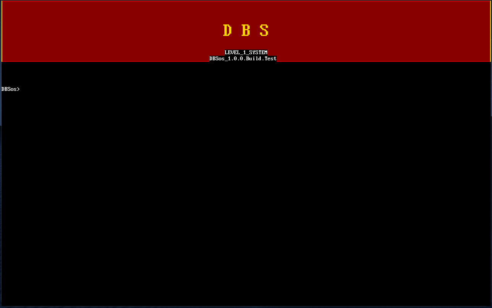
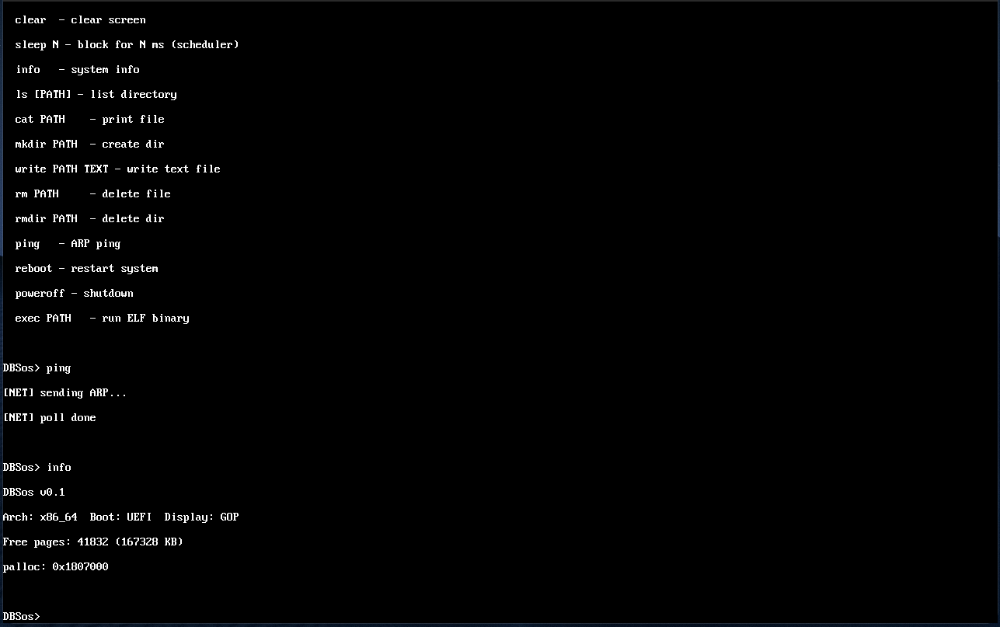

<p align="center">
  
  
  
  
  
  
  
  
</p>

<p align="center">
  <b>English</b> | <a href="README.md">Русский</a>
</p>

<h1 align="center">DBSos</h1>

<p align="center">
  <b>Custom microkernel operating system</b><br>
  Written in <a href="https://www.rust-lang.org/">Rust</a> for <b>x86_64</b> architecture<br>
  Boots via <b>UEFI</b> using the <a href="https://github.com/limine-bootloader/limine">Limine</a> bootloader
</p>

> **Project goal** — build a full-featured OS in Rust with support for Linux and Windows 10 programs. Priorities: security and performance.

---

## Screenshots

<p align="center">
  
  <br><i>Boot screen with "DBS" logo and shell prompt</i>
</p>

<p align="center">
  
  <br><i>Commands help, ping (ARP), info</i>
</p>

---

## Quick Start

```bash
# 1. Install Rust + target
rustup target add x86_64-unknown-uefi

# 2. Clone and build
git clone https://github.com/i000993i/DBSos.git
cd DBSos
cargo build -p dbsos-kernel --target x86_64-unknown-uefi

# 3. Prepare ESP
mkdir -p esp/EFI/BOOT
cp target/x86_64-unknown-uefi/debug/dbsos-kernel.efi esp/EFI/BOOT/BOOTX64.EFI

# 4. Run in QEMU
qemu-system-x86_64 \
  -machine q35 \
  -drive if=pflash,format=raw,readonly=on,file=/usr/share/ovmf/OVMF_CODE.fd \
  -drive file=fat:rw:esp,format=raw \
  -drive file=nvme_disk.img,if=none,id=nvme0,format=raw \
  -device nvme,serial=deadbeef,drive=nvme0 \
  -m 256M -nic user,model=e1000 -nographic -no-reboot
```

> OVMF path may vary: `find / -name "OVMF_CODE.fd" 2>/dev/null`

### Windows (PowerShell)

```powershell
.\scripts\bootstrap.ps1 -Run    # build + run
.\scripts\bootstrap.ps1          # build only
```

---

## Architecture

```
┌─────────────────────────────────────────────────┐
│  Ring 3 (User)                                  │
│  ┌───────────┐ ┌───────────┐ ┌───────────┐      │
│  │ Console   │ │ e1000     │ │ ELF       │      │
│  │ Server    │ │ Driver    │ │ Binary    │      │
│  └─────┬─────┘ └─────┬─────┘ └─────┬─────┘      │
│        └──────────────┼─────────────┘            │
│                       │ IPC (capabilities)       │
├───────────────────────┼─────────────────────────┤
│  Ring 0 (Kernel)      ▼                         │
│  ┌──────────────────────────────────────────┐   │
│  │ Memory │ VM │ Scheduler │ Syscall │ FS   │   │
│  │ UART │ PCI │ AHCI │ NVMe │ e1000 │ PS/2 │   │
│  └──────────────────────────────────────────┘   │
│  Boot: Limine → UEFI → ExitBootServices → Shell │
└─────────────────────────────────────────────────┘
```

**Key principles:**
- **Microkernel** — minimal kernel, servers run in Ring 3
- **Capability-based** — resource access through capabilities
- **no_std** — no Rust standard library
- **Preemptive** — multitasking via LAPIC timer (~100 Hz)
- **ELF loading** — user binaries from FAT filesystem

---

## Shell Commands

| Command | Description | Command | Description |
|---------|-------------|---------|-------------|
| `help` | Show help | `exec PATH` | Run ELF binary |
| `info` | System info | `ping` | ARP ping gateway |
| `mem` | Memory stats | `nvme info` | NVMe disk info |
| `time` | Timer test | `nvme read LBA` | Read sectors |
| `clear` | Clear screen | `nvme write LBA` | Write sectors |
| `sleep N` | Delay N ms | `reboot` | ACPI reboot |
| `ls [PATH]` | List files | `poweroff` | ACPI shutdown |
| `cat PATH` | Print file | | |
| `mkdir PATH` | Create dir | | |
| `write PATH TXT` | Write file | | |
| `rm PATH` | Delete file | | |
| `rmdir PATH` | Delete dir | | |

---

## Current Status

### Implemented

| Component | Status | Component | Status |
|-----------|--------|-----------|--------|
| UEFI Boot (Limine) | ✅ | FAT16 FS (read/write) | ✅ |
| Physical Memory (bitmap) | ✅ | VFAT LFN | ✅ |
| Virtual Memory (4-level paging) | ✅ | NVMe Driver | ✅ |
| Preemptive Scheduler | ✅ | AHCI SATA Driver | ✅ |
| GDT / IDT / PIC / LAPIC | ✅ | e1000 NIC (ARP/ICMP) | ✅ |
| SYSCALL / SYSRET (24 calls) | ✅ | PS/2 Keyboard | ✅ |
| IPC (capabilities) | ✅ | UART (16550A) | ✅ |
| Shared Memory (zero-copy) | ✅ | ELF Loader | ✅ |
| ACPI (reboot/shutdown) | ✅ | Ring 3 Tasks | ✅ |
| HPET Timer | ✅ | Display (GOP) | ✅ |
| Interactive Shell (15+ cmds) | ✅ | PCI Bus | ✅ |

### In Progress

| Component | Priority |
|-----------|----------|
| Page Fault Handler | High |
| TCP/IP Stack | High |
| FS Server (Ring 3) | Medium |
| DHCP / DNS | Medium |
| Multi-core (SMP) | Medium |
| Backtrace | Low |
| CI/CD | Low |

---

## Author and License

**Author:** i000993i | **License:** [CC BY-SA 4.0](https://creativecommons.org/licenses/by-sa/4.0/deed.en)

Use, modify, distribute (including commercially). Condition: credit author and show changes. New versions must use the same license.

---

## Sources

| Resource | Link |
|----------|------|
| x86 SDM | [Intel](https://www.intel.com/content/www/us/en/developer/articles/technical/intel-sdm.html) |
| UEFI Spec | [uefi.org](https://uefi.org/specifications) |
| Limine | [GitHub](https://github.com/limine-bootloader/limine) |
| Rust no_std | [Rustonomicon](https://doc.rust-lang.org/nomicon/) |
| FAT16 | [Microsoft](https://learn.microsoft.com/en-us/windows/win32/filesystem/long-fat-file-system) |
| e1000 | [Intel](https://www.intel.com/content/dam/www/public/us/en/documents/pci-ide-interrupt-manual.pdf) |
| ACPI | [acpi.info](https://acpi.info/specifications.htm) |
| QEMU | [Documentation](https://www.qemu.org/docs/) |

---

<p align="center">
  <i>DBSos v0.1 — Built with ❤️ and Rust</i><br>
  <sub>Author: i000993i | License: CC BY-SA 4.0</sub>
</p>
